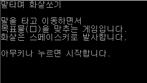
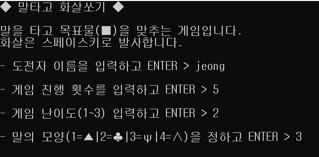
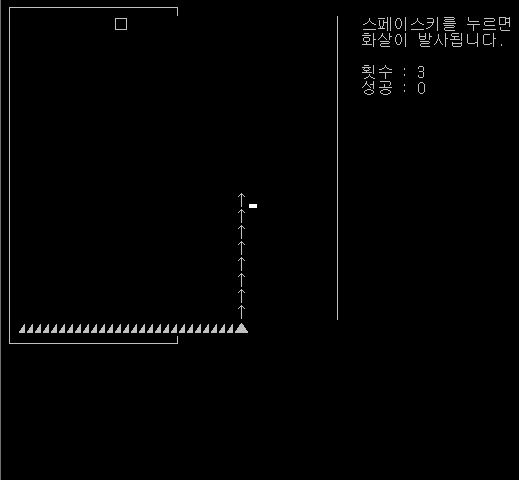
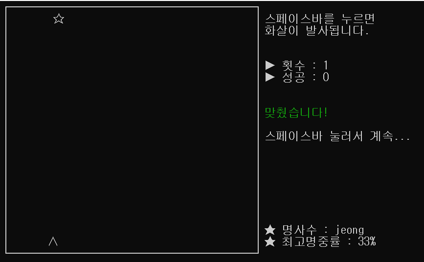
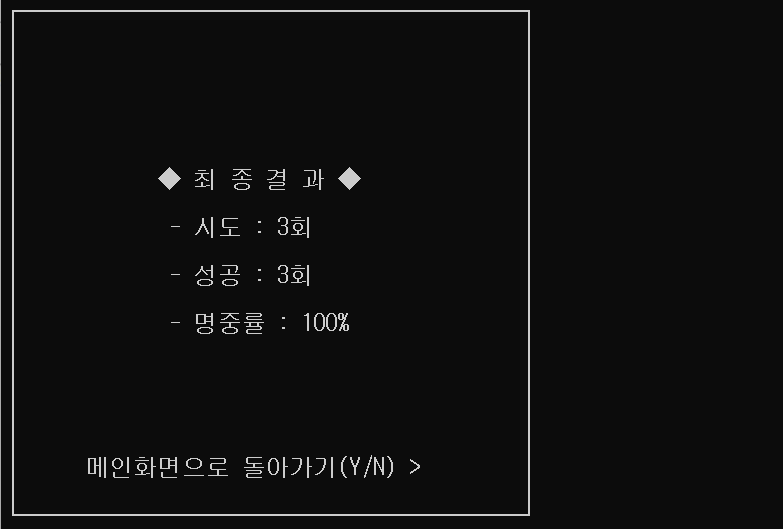

# 활쏘기 게임 개선    
* 보완 및 업그레이드
  - 게임 내 네모 테두리 부자연스러운 부분 수정
  - 말, 화살이 중첩되서 보이는 현상 수정
  - 목표물의 피격 범위 수정
  - 명중/오중 시 문자열 내용 및 색깔 변화하게 수정
  - 커서 숨김
  - 결과창 개선 및 인트로화면으로 리턴 기능
  - 최고기록 표시
  - 시도 횟수 및 난이도 조절 기능
  - 말 모양 변경 기능
  - 효과음(명중)
* * *    
- 인트로 화면    
</img></img> 
* * *
- 게임 내부 화면    
</img> </img> 
* * *
- 게임 결과 화면    
</img> 
