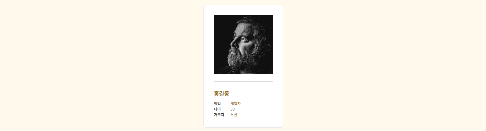

# CSS Framework
>[bootstrap](https://www.w3schools.com/bootstrap/bootstrap_ref_all_classes.asp)   
>[bulma](https://bulma.io/)   
>[tachyons](http://tachyons.io/)

 * **bootstrap : [Buttons](https://www.w3schools.com/bootstrap/tryit.asp?filename=trybs_button_styles&stacked=h)**   
 </img>
     ```html
        <ul>
            <li>
                <a class="btn btn-info" href="tel:0100000000">010-000-0000</a>
            </li>
            <li>
                <a class="btn btn-info" href="mailto:mail@mail.com" target="_blank">mail@mail.com</a>
            </li>
            <li>
                <a class="btn btn-info" href="https://facebook.com/myfacebook" target="_blank">@myfacebook</a>
            </li>
            <li>
                <a class="btn btn-info" href="https://naver.blog.com/myblog" target="_blank">@myblog</a>
            </li>
        </ul>
    ```
 * **bulma : [Notification](https://bulma.io/documentation/elements/notification/)**   
 </img>
    ```html
       <body class="notification is-warning is-light">
           ...
           ...
           ...
       </body>
    ```
 
 * **tachyons : [Profile Card](http://tachyons.io/components/cards/profile-card/index.html)**   
 </img>
     ```html
        <section class="mw5 center bg-white br3 pa3 pa4-ns mv3 ba b--black-10" id="my_info">
            <h2>My info</h2>
            
            <hr class="mw30 bb bw1 b--black-10">
            <table>
                <tbody>
                    <tr id="myname">
                        <th>이름</th>
                        <td>홍길동</td>
                    </tr>
                    <tr>
                        <th>직업</th>
                        <td>개발자</td>
                    </tr>
                    <tr>
                        <th>나이</th>
                        <td>38</td>
                    </tr>
                    <tr>
                        <th>거주지</th>
                        <td>부산</td>
                    </tr>
                </tbody>
            </table>
        </section>
     ```

> [github.io 링크](https://seong2517.github.io/Game_Programming/)   
> [netlify 링크](https://stalwart-bublanina-454900.netlify.app)
