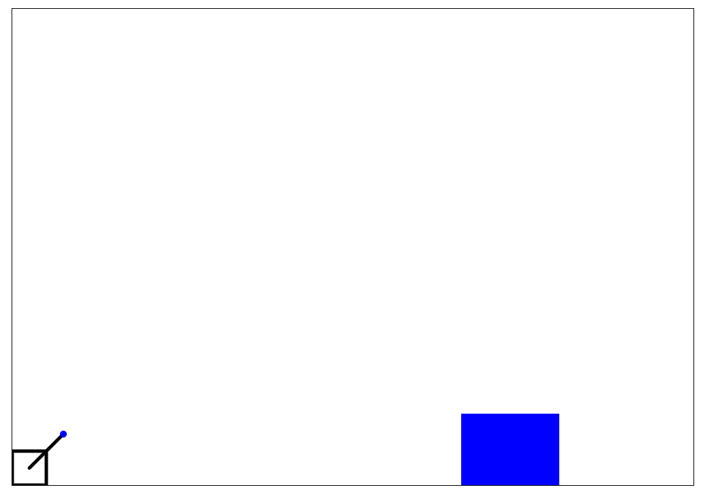
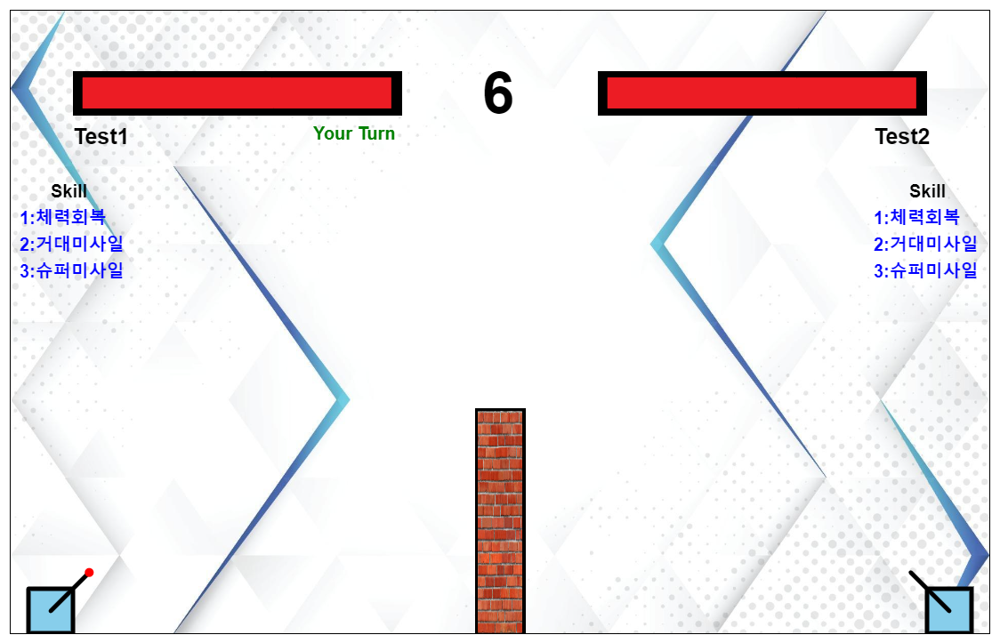

# 포트리스 게임 개선    
* 보완 및 업그레이드
  - 
  - canvas, 최대 이동 거리 등 잘못된 수치 수정
  - confirm창 문제, 발사 이후 움직임 등 버그 수정
  - 1:1 모드(턴제) 추가
  - 배경 이미지 추가
  - 방해물 추가
  - HP 추가 및 그래픽화
  - 플레이어명 추가
  - 효과음(발사, 명중, 스킬) 추가
  - 스킬 3종 추가(skillHandler())
  - 타이머 추가
* * *    
- 인트로 화면    
</img>
--->
</img> 
* * *
- 게임 내부 화면    
</img>
--->
</img> 
* * *
- 게임 결과 화면    
</img>       

### 호스팅 주소
> [github.io](https://seong2517.github.io/Game_Programming/)   
> [netlify](https://stalwart-bublanina-454900.netlify.app)
